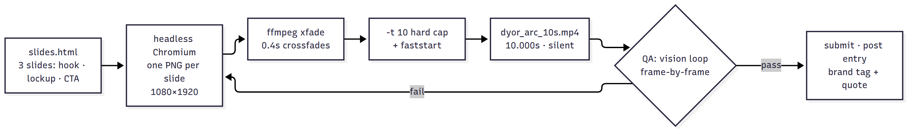

# dyor-arc-contest



**A 10-second silent contest entry, built from HTML slides and ffmpeg — proof you can ship contest video without After Effects.**

Entry for the **@DYORSWAPDEX × @arc** video contest: 10 seconds, silent, both brands on screen. Deadline was ~26 hours away, so no motion-graphics suite — three HTML slides, headless Chromium for frames, ffmpeg for the cut. The artifact ships in the repo: `dyor_arc_10s.mp4`.

## What it is

- **The entry:** `dyor_arc_10s.mp4` — 1080×1920, 30 fps, exactly **10.000 s** (ffprobe, not a feeling), zero audio — silent for real.
- **The source:** `slides.html` — 3 slides: text hook → DYOR × ARC brand lockup → CTA.
- **The stack:** HTML + CSS for design, Chromium for rendering, ffmpeg for assembly. No Premiere, no After Effects.

## How it works



Brand assets are official: the ARC wordmark from arc.io, the DYOR mark from their X profile, the contest poster blurred into slide 2's backdrop. Frame 2 took three vision-QA rounds before it passed.

## Quickstart

```bash
git clone https://github.com/urelkdubdqwr/dyor-arc-contest.git
cd dyor-arc-contest

# verify the entry: 1080x1920, 30 fps, 10.000 s, no audio stream
ffprobe dyor_arc_10s.mp4

# open the slide source in a browser
xdg-open slides.html   # or just double-click it
```

Needs: any browser for the slides, `ffprobe`/`ffmpeg` to inspect or re-cut.

## Contest checklist

| Requirement | Where it lands |
|---|---|
| text "DYOR IN ARC" | slide 1, 150px |
| text "Do Your Own Research" | slide 1 + end card |
| DYOR brand element | official X profile mark, slide 2 |
| ARC brand element | official arc.io logo, slide 2 (white wordmark, glow) |
| quote + tag both brands | entry post complies |

## What's inside

| Path | What it is |
|---|---|
| `dyor_arc_10s.mp4` | Final entry. 1080×1920, 30 fps, 10.000 s, no audio. |
| `slides.html` | Slide source: hook → DYOR × ARC lockup → CTA, pure HTML/CSS. |
| `arc_logo_white.svg` | Official ARC wordmark used on slide 2. |
| `assets/header.svg` | Repo banner. |

## License

MIT — see [LICENSE](LICENSE).

---

*gak menang? lo baru aja nonton 10 detik terbaik kontes itu.* 🦅
